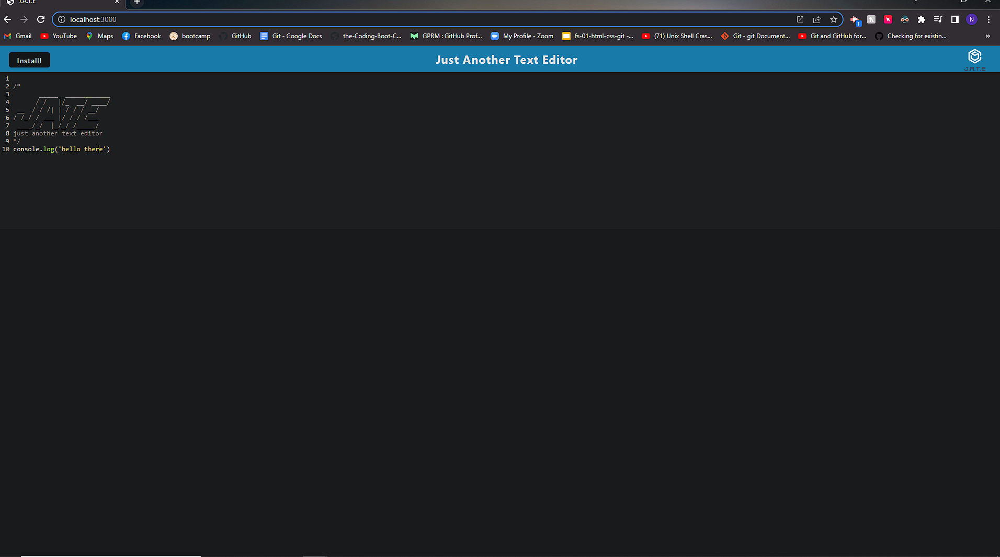
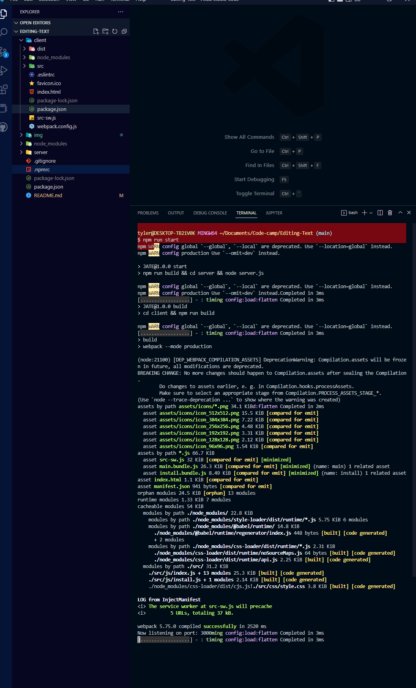
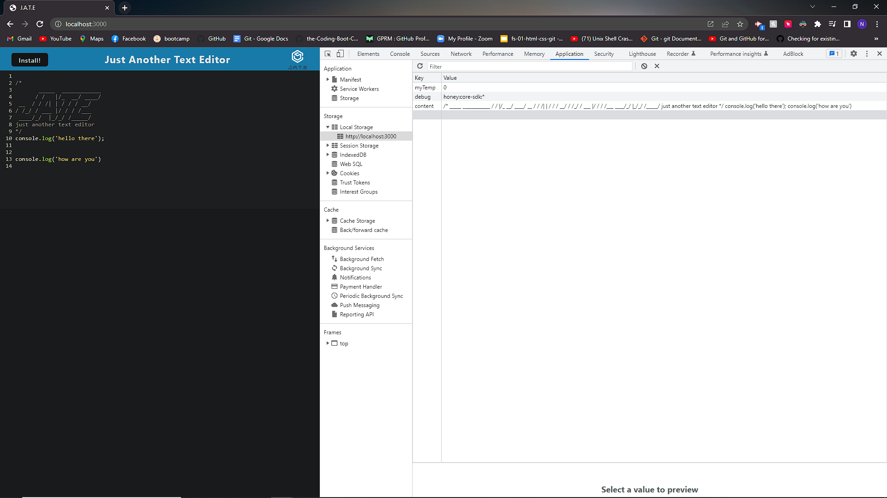
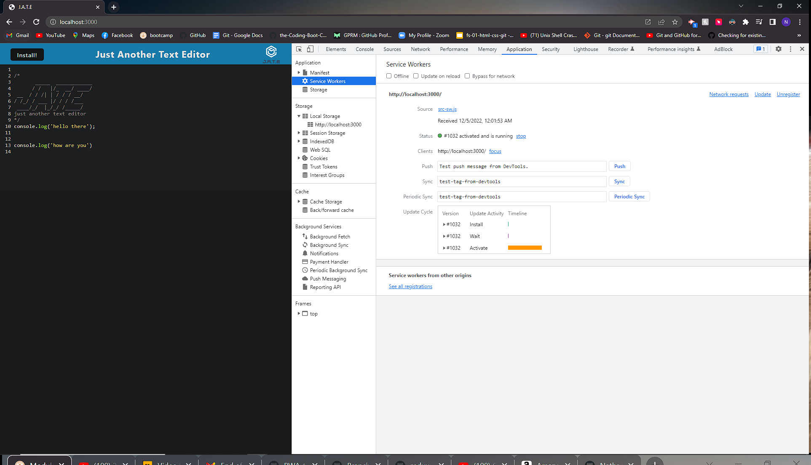
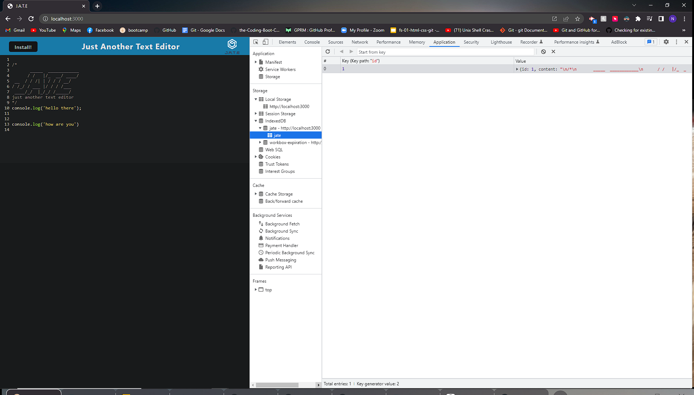

# Editing-Text
  # Description
 J.A.T.E. Just Another Text Editor 
  # Table of contents
- [Editing-Text](#editing-text)
- [Description](#description)
- [Table of contents](#table-of-contents)
- [Installation](#installation)
- [Usage](#usage)
- [License](#license)
- [Contributors](#contributors)
- [Tests](#tests)
- [Questions](#questions)
 # Installation
  The following necessary dependecies must be installed to run the aplication: express, if-env, concurrently, nodemon, webpack
  
  # Usage
  An app to create notes or code snippets with or without an internet connection

  # License
  This project is licensed under the None license.
  
  # Contributors
  Contributors: youtube.com, google.com, and UTA documentation
  # Tests
  The folloing is needed to run the test: n/a
  # Questions
  If you have any questions about the repo, contact tylercharro@gmail.com

  #To run 
  do an npm install, then an npm run start

  #github repo link:
   https://github.com/NathanTyle/Editing-Text

   #github pages link:
   https://nathantyle.github.io/Editing-Text/

